# Hi, I'm Ibrahim 👋

CS student building at the intersection of **AI**, **data**, and **backend systems**.
I'm currently exploring agentic AI, scalable architectures, and real-world SaaS products.

---

## 🛠 Tech Stack

---

## 🔭 Currently Working On

- **[ats-backend](https://github.com/ibrahimhzhz/ats-backend)** — An AI-powered applicant tracking system backend built in Python
- **[loq-hr](https://github.com/ibrahimhzhz/loq-hr)** — A real-world HR SaaS product in JavaScript
- Exploring **agentic AI workflows** and **scalable system design**

---

## 📊 GitHub Stats

  
  

---

## 📬 Connect

